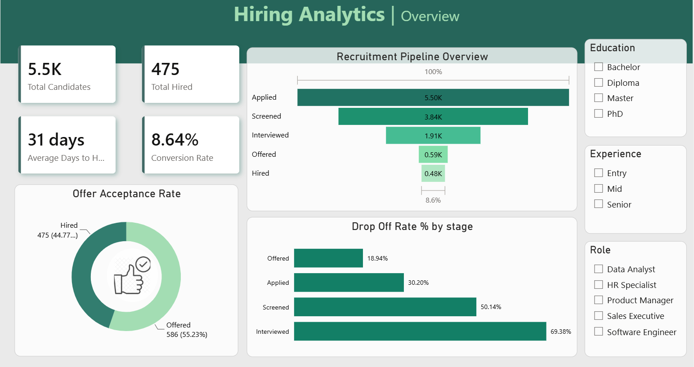
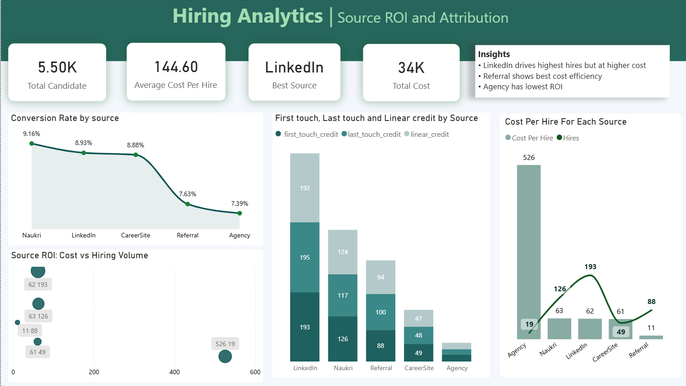
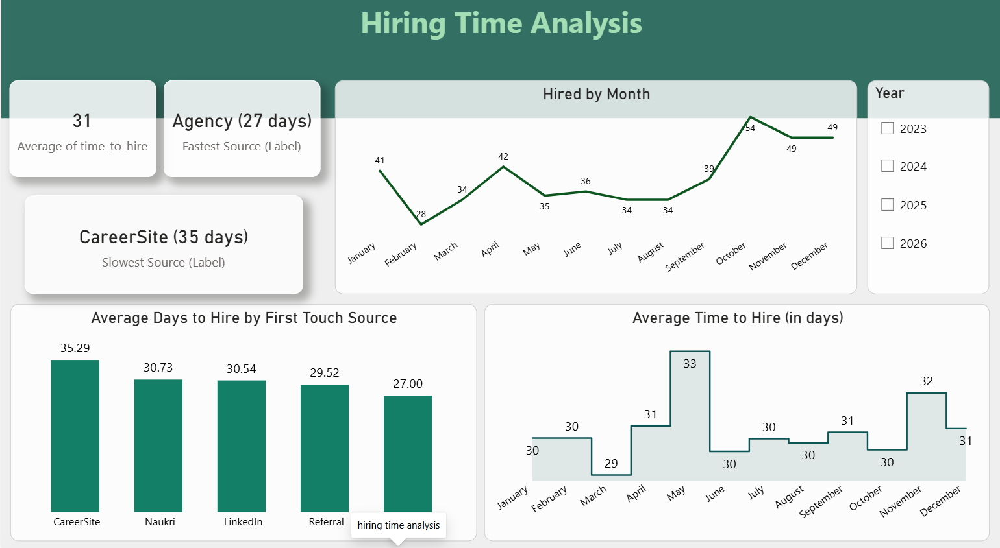

# End-to-End Hiring Analytics Platform

An end-to-end recruitment analytics project built to help HR and talent acquisition teams understand hiring-funnel performance, sourcing-channel effectiveness, recruitment costs, and time-to-hire.

The project demonstrates a complete analytics workflow: **Python data preparation → PostgreSQL → dbt transformations → Power BI dashboards**. It uses synthetic recruitment data for portfolio and learning purposes.

## Business Problem

Recruitment teams need to understand more than the number of candidates hired. They need to know where candidates leave the hiring process, which sourcing channels contribute to hires, how much those channels cost, and how long recruitment takes.

This platform brings those questions together in a repeatable data pipeline and a set of interactive Power BI reports.

## Objectives

- Analyze candidate progression through the recruitment funnel.
- Measure stage conversion and candidate drop-off.
- Compare sourcing channels using hiring volume, conversion, and cost metrics.
- Compare first-touch, last-touch, and linear attribution approaches.
- Track hiring trends and time-to-hire.
- Build reusable, testable SQL transformations for downstream reporting.

## Technology Stack

| Technology | Purpose |
|---|---|
| Python and pandas | Generate and prepare data, clean fields, and export CSV files |
| CSV | Portable input files for the data pipeline |
| PostgreSQL | Store raw and analytical data and support SQL analysis |
| dbt Core | Organize SQL transformations, model dependencies, seeds, and data tests |
| Power BI | Interactive dashboards, KPI cards, slicers, and visual analysis |
| DAX | Calculate dashboard measures and business KPIs |

## Architecture

```text
Synthetic recruitment data
          |
          v
   CSV input files
          |
          v
Python / pandas
Data cleaning and validation
          |
          v
      PostgreSQL
Raw source tables and seed data
          |
          v
          dbt
Staging -> intermediate / fact models
          |
          v
Business marts and attribution models
          |
          v
       Power BI
Recruitment funnel, sourcing ROI,
attribution, and hiring-time analysis
```

## Key Features

### 1. Recruitment Funnel Analytics

Analyze candidate progression through stages such as:

**Applied → Screened → Interviewed → Offered → Hired**

The funnel and stage-level metrics help reveal where candidate volume decreases. Stage counts should use distinct candidate identifiers where candidates can have multiple event records.

### 2. Sourcing Channel Performance

Compare channels such as LinkedIn, Naukri, referrals, agencies, and career sites using available source fields and cost data.

Questions the analysis can answer include:

- Which channel contributes the most hires?
- Which channel has the highest candidate-to-hire conversion?
- Which channel has the lowest cost per hire?
- Does the highest-volume channel also perform efficiently?

### 3. Multi-Touch Attribution

A candidate may interact with several sourcing channels before being hired. The platform compares three attribution approaches:

- **First-touch:** assigns the hire's credit to the first recorded source.
- **Last-touch:** assigns the credit to the last recorded source.
- **Linear:** distributes credit equally across the recorded touchpoints.

Comparing these models helps show how the perceived contribution of a source changes depending on the attribution rule.

### 4. Hiring Time Analysis

Analyze time-to-hire for candidates with valid hire dates. The report can compare average and median time-to-hire, hiring trends over time, and hiring speed by source or other available candidate attributes.

Candidates who were not hired should not be assigned an artificial time-to-hire value.

### 5. Interactive Power BI Reporting

The reports bring together KPI cards, funnel and drop-off visuals, monthly trends, source comparisons, attribution comparisons, and cost-efficiency analysis. Slicers allow users to explore the data by supported dimensions such as year, role, source, or location.

## KPIs and Business Metrics

| KPI | Definition |
|---|---|
| Total Candidates | Distinct candidates in the selected population |
| Total Hires | Distinct candidates who reached the hired outcome |
| Stage Conversion Rate | Candidates reaching a stage ÷ candidates in the defined preceding population |
| Stage Drop-off Rate | Candidates lost between consecutive stages ÷ candidates entering the earlier stage |
| Offer Acceptance Rate | Accepted offers or hires ÷ offers, according to the project's defined event logic |
| Average Time-to-Hire | Average elapsed days between the defined start date and hire date for hired candidates |
| Median Time-to-Hire | Median elapsed days for hired candidates |
| Cost per Hire | Source spend ÷ hires, using the explicitly selected source-credit rule |
| Cost per Attributed Hire | Source spend ÷ attributed hires |
| Attributed Hires | Sum of source-level attribution credits under a selected model |

## Multi-Touch Attribution

Example journey:

```text
LinkedIn -> Career Site -> Referral -> Hired
```

## Power BI Dashboards

The report is designed to support analysis across the following areas:

- 

  
- 

  
- 

## Project Structure

The exact file layout may vary as the project evolves. Conceptually, the repository contains these components:

```text
Hiring_Analytics_platform/
├── data/                 # Generated or cleaned CSV files, if included
├── models/
│   ├── staging/          # Standardized source models
│   ├── intermediate/     # Reusable transformations, if present
│   └── marts/            # Hiring, attribution, and ROI models
├── seeds/                # Static reference CSVs, such as source costs
├── dbt_project.yml       # dbt project configuration
├── profiles.yml          # Local connection configuration; do not commit secrets
├── requirements.txt      # Python dependencies, if included
└── README.md
```

This is a conceptual guide, not a guarantee that every listed directory or file exists in the current repository. Use the actual repository tree as the source of truth.

## Limitations and Future Enhancements

- Replace synthetic data with appropriately governed ATS and recruitment-marketing data.
- Add automated pipeline scheduling and monitoring.
- Expand source-cost modelling to campaign-level or monthly spend where data is available.
- Add more data tests for referential integrity, valid stage sequences, and metric reconciliation.
- Implement and validate a controlled A/B testing module before reporting experimental results.
- Add documentation and screenshots for each Power BI report page.


---

*This project is for educational and portfolio purposes. All analytical findings should be interpreted in the context of the synthetic data and documented metric definitions.*
